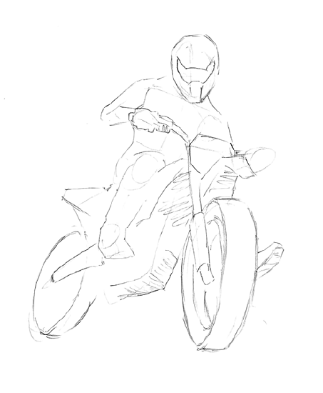

<!doctype html>
<html lang="tr">
  <head>
    <meta charset="utf-8">
    <meta name="viewport" content="width=device-width, initial-scale=1, shrink-to-fit=no">
    <link rel="stylesheet" href="https://cdn.jsdelivr.net/npm/bootstrap@4.5.3/dist/css/bootstrap.min.css" integrity="sha384-TX8t27EcRE3e/ihU7zmQxVncDAy5uIKz4rEkgIXeMed4M0jlfIDPvg6uqKI2xXr2" crossorigin="anonymous">
    <link rel="stylesheet" href="style.css">
    <title>ikiteker_ANASAYFA</title>
    <link rel="preconnect" href="https://fonts.googleapis.com">
    <link rel="preconnect" href="https://fonts.gstatic.com" crossorigin>
    <link href="https://fonts.googleapis.com/css2?family=Architects+Daughter&family=Inter:wght@400;500;600;700;800&display=swap" rel="stylesheet"> </head>
  <body>
    

      

          

            

              <nav class="main-menu float-left">
                <ul class="top-menu d-flex flex-row navigation top-menu justify-content-start list-unstyled ">
                        <li class="menu-item order-first"><a href="Trainings.html">Eğitimler </a></li>
                        <li class="menu-item"><a href="Trainers.html">Eğitmenler</a></li>
                        <li class="menu-item order-last"><a href="Trainings.html">Eğitim Programı</a></li>
                </ul>
              </nav>
            

            

              <header class="text-center" style="width:100%">İKİ TEKER MOTOSİKLET AKADEMİSİ</header>
            

            

              
            

          

        

    

    <section>
       

        

          

          
          

          <h5 class="card-title">Biz Kimiz?</h5>
          
İkiteker Motosiklet Akademisi, 1999 yılından itibaren sürücü eğitimi alanında hizmet vermektedir. Bugüne kadar 4000′den fazla sürücüye A2 sınıf ehliyet vermiştir. Kurumumuz 2006 yılı itibariyle, “Güvenli Sürüş” sloganıyla motosiklet eğitim faaliyetlerine başlamıştır. Amacımız A2 ehliyet alan her motosiklet kullanıcısının, doğru bilgilerle donatılarak , uzun bir motosiklet hayatına başlamasını sağlamaktır. 1 yılı geçen bir süredir 100 ‘ün üzerinde kursiyere Temel, Teori, Güvenli Sürüş Eğitimi ve Güvenli Yol Sürüş Eğitimi vermiştir. Her geçen gün artan motosiklet kullanıcısını göz önünde bulundurarak, bilinçli motosiklet sürücüleri yetiştirmek en önemli hedefimizdir.

          <a href="index.html" class="btn btn-primary">Anasayfa</a>
         

        

        

       

    </section>
      <footer>
        

          

            
  
            <article>
                <h6>İletişim</h6>
                <address>
                Kremou 129/Kallithea/Atina
                </address>
                <ul class="text-center list-unstyled">
                    <li><a href="Tel:+90123456789">+90123456789</a></li>
                    <li><a href="mailto:emirustun@gmail.com">mailto:emirustun@gmail.com</a></li>
                </ul>
                

            </article>
            

          

        

    
      </footer>
    <!-- Optional JavaScript; choose one of the two! -->

    <!-- Option 1: jQuery and Bootstrap Bundle (includes Popper) -->
    
    

    <!-- Option 2: jQuery, Popper.js, and Bootstrap JS
    
    
    
    -->
  </body>
</html>