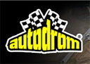
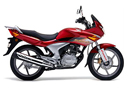
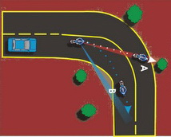
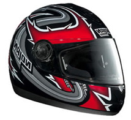
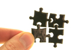

<!DOCTYPE html>
<html lang="tr">
<head>
    <meta charset="UTF-8">
    <meta http-equiv="X-UA-Compatible" content="IE=edge">
    <meta name="viewport" content="width=device-width, initial-scale=1.0">
    <title>ikiteker_anasayfa</title>
    <link rel="stylesheet" href="style/style.css">
    <link rel="preconnect" href="https://fonts.gstatic.com" crossorigin>
   
    
</head>
    <body>
   
    <!-- header -->
    <header>
        <h1 class="baslik">İki Teker</h1> 
        <h1 class="baslik">Motosiklet Akademisi</h1>
    </header>
    <!-- nav -->
     <nav class="nav">
        <ul class="nav">
            <li class="nav"><a href="Hakkımızda.html">Hakkımızda </a></li>
            <li class="navleft"><a href="Eğitimler.html">Eğitimler </a></li>
            <li class="navleft"><a href="Eğitmenler.html">Eğitmenler</a></li>
        </ul>
    </nav>
    <article class="aciklama">
    
Bugüne kadar 4000′den fazla sürücüye A2 sınıf ehliyet vermiş olan kurumumuz 2006 yılı itibariyle , “Güvenli Sürüş” sloganıyla motosiklet eğitim faaliyetlerine başlamıştır.

     
    
Amacımız A2 ehliyet alan her motosiklet kullanıcısının , doğru bilgilerle donatılarak , uzun bir motosiklet hayatına başlamasını sağlamaktır.

    
             
        <ul style="list-style-type:none;">
                <li> EĞİTİM PİSTİ: Trafiğe kapalı özel asfalt ve özel işaretler ile sizin eğitiminiz için hazırlanmış güvenli ortam.</li>  
                <li> MOTOSİKLET TEMİNİ:  Temel eğitim kategorisinde katılımcılara arzu ettikleri takdirde motosiklet temin edilmektedir. Güvenli Sürüş ve Güvenli Yol Sürüş eğitimleri kursiyerlerin kendi motosikletleri ile verilmektedir.</li>  
                <li> TEORİ EĞİTİMİ :  Motosiklete başlangıç, güvenli sürüş teknikleri, fren, konumlanma, bakış, trafik ile ilgili teori konularının işlendiği eğitimimiz.</li>  
                <li> GÜVENLİK :  Temel eğitim kategorisinde ,katılımcılara kask, eldiven, dizlik temin edilir. Diğer eğitim programlarımızda kursiyerlerimiz kendi koruyucu ekipmanlarını getirmelidir.</li>  
                <li> EĞİTİM PROGRAMI :  İhtiyacınıza ve seviyenize göre farklı kategorilerde eğitim verilmektedir. Kişinin bireysel durumuna göre özel eğitim.</li>
        </ul>
          
    </article>
    

    <footer>
    <section>
        <article>
            <h4>İletişim</h4>
            <address>
            Kremou 129/Kallithea/Atina
            </address>
            <ul style="list-style-type:none;">
                <li><a href="Tel:+90123456789">+90123456789</a></li>
                <li><a href="mailto:emirustun@gmail.com">mailto:emirustun@gmail.com</a></li>
            </ul>
            

        </article>
    </section>
    </footer>
</body>

</html>