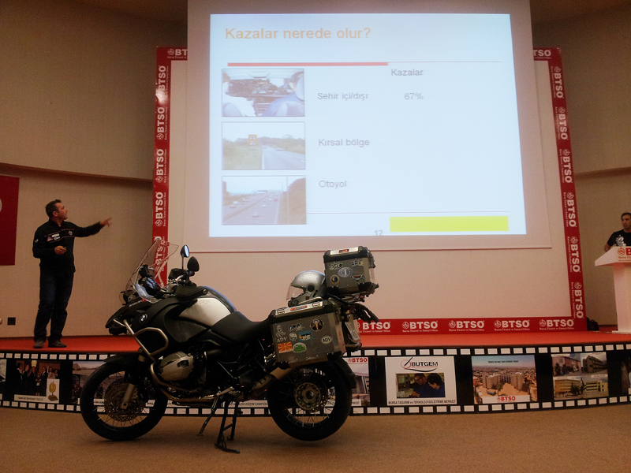
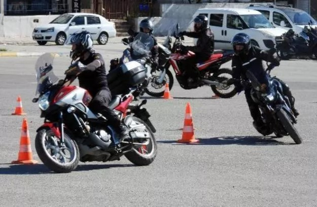
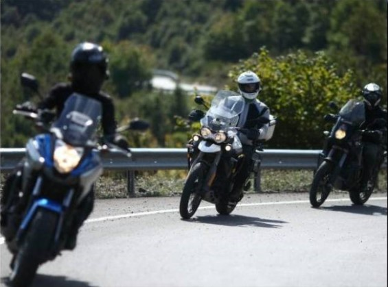

<!DOCTYPE html>
<html lang="tr">
<head>
    <meta charset="UTF-8">
    <meta http-equiv="X-UA-Compatible" content="IE=edge">
    <meta name="viewport" content="width=device-width, initial-scale=1.0">
    <title>Eğitimler</title>
    <link rel="stylesheet" href="style/style.css">
    
</head>
<body>
    <header>
        <h1 class="baslik">İki Teker</h1> 
        <h1 class="baslik">Motosiklet Akademisi</h1>
    </header>
    <nav class="nav">
        <ul class="nav">
            <li class="nav"><a href="Anasayfa.html">Anasayfa </a></li>
            <li class="navleft"><a href="Hakkımızda.html">Hakkımızda </a></li>
            <li class="navleft"><a href="Eğitmenler.html">Eğitmenler</a></li>
    </ul>
    </nav>
    <article class="aciklama">
        <h2 class="baslik">Eğitimler</h2>
        <ul style="list-style-type:none;">
            <li> Teori Eğitim Programı ; Teori Eğitim Programı ; motosiklete henüz başlamamış, yeni başlayan veya uzun süredir motosiklet kullanan ve tekrar etmek isteyen kursiyerlere yönelik bir eğitimdir.

                Eğitimin içeriği ; Öğrencilere Motosiklet nedir ? Nasıl kullanılmalıdır ? Güvenli Sürüş için esas temellerini anlatan/tazeleyen 4-6 saatlik bilgisayar sunumu ile eş zamanlı olarak sunulan bir eğitimdir.
                
                İçeriğinde Güvenlik, Vizyon, Pozisyon, Viraj, Fren, Sollama ve Şehir içinde tehlikeler, sürüş mesafe ayarlama vb. konular bu interaktif kursun kapsadığı bazı noktalardır. Bilgisayarlı görsel sunum ile pekiştirilmiş öğretici, örnekleyici fotoğraf ve ilüstrasyonlar eşliğinde anlatılmaktadır.
                
                Eğitim, Kadıköy’de bulunan merkez binamızda, klimalı 25 kişilik sınıflarımızda, bilgisayarlı projeksiyon sistemi kullanılarak verilmektedir. İnteraktif katılım ile, kursiyerler ile soru-cevap şeklinde yürütülen bu eğitim de, kursiyerlerin kafalarında ki soru işaretlerine de çözüm bulmaktadır.
                
                Her motosiklet sürücüsünün katılması gereken bir eğitim programıdır.</li>  
            <li> Güvenli Sürüş Eğitimi ;  Programın içeriği ; Motosikletin günlük ve haftalık kontrolleri, düşük hızda motosikletin stabilizasyonu ve kontrolü, direksiyon ve yoldan çıkma, frenleme ve acil durumda frenleme, dar-geniş ve değişken slalom, vitesler ve ilk yardım kuralları, viraj alma, virajda engelden kaçma, virajda fren, bakışın önemi uygulamaları içermektedir. Yüksek standartta emniyetle, öğrencilerin anlama serviyesine göre adapte edilmiş program, Güvenli Yol Sürüş eğitimi ( GYSE) için de yeterlilik testi niteliğindedir. Kursiyerler, ancak bu eğitimden tam başarı ile geçmesi durumunda, Güvenli Yol Sürüş eğitimi ( GYSE) eğitimine katılabilmektedirler. Motosikleti kontrol etme üzerine yoğunlaşmış ideal bir program olan bu kurs, “Temel Eğitimi” başarıyla geçmiş ve minimum 1000 km. tecrübesi olan sürücüler için uygundur.</li>  
            <li> Güvenli Yol Sürüş Eğitimi :  Güvenli Yol Sürüş Eğitimi’nin temel amacını, “SIPDE yani türkçe karşılığı TATKU olan Tara, Algıla, Tahmin et, Karar ver, Uygula sistemini her koşul atında uygulamaktır.” olarak açıklayabiliriz.

                Her kursiyer sahibi olduğu motosikleti ile eğitime katılmaktadır. Eğitim için motosiklet temin edilmemektedir.
                
                Eğitim, Motosikletin Teori temelleri ile başlar (motosiklet nedir, doğru oturuş pozisyonu, frenleme teknikleri, agirlik transferi mantığı, viraj nedir ?, viraj çizgisi, apeks, trafikte sürüş vb. teori dersleri Bilgisayar ortamında hazırlanmış slayt gösterisi ile 09:30 - 12:00 saatleri arasında kursiyere anlatılmaktadır. </li>  
            
    </ul>
    </article>
    

    <footer>
        <section>
            <article>
                <h4>İletişim</h4>
                <address>
                Kremou 129/Kallithea/Atina
                </address>
                <ul style="list-style-type:none;">
                    <li><a href="Tel:+90123456789">+90123456789</a></li>
                    <li><a href="mailto:emirustun@gmail.com">mailto:emirustun@gmail.com</a></li>
                </ul>
                

            </article>
        </section>
    </footer>
</body>
</html>